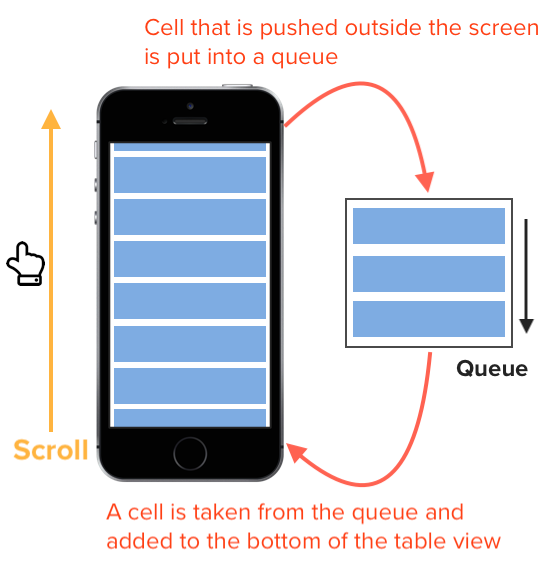
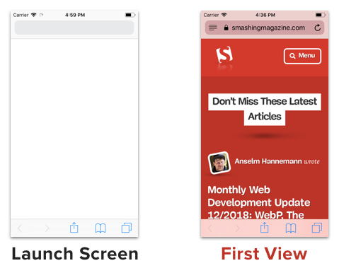
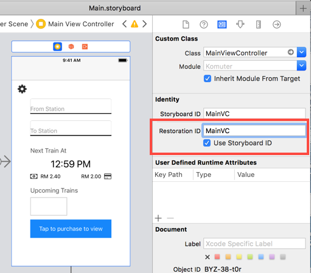

# 5 iOS Performance Tricks to make your app feel more performant


## 1. Dequeue reusable cell

When you search for tutorials on implementing table view on the internet, most of them will instruct you to use the **tableView.dequeueReusableCell(withIdentifier:, for:)** method in **tableView(_:cellForRowAt:)** to reuse a cell. What is the function of reusable cell? To explain this, we will first look at scenario without using reusable cell.


Say you have a table view with 1000 rows, without using reusable cells, we will have to create a new cell for each row like this : 

```swift
func tableView(_ tableView: UITableView, cellForRowAt indexPath: IndexPath) -> UITableViewCell {
    // create a new cell whenever cellForRowAt is called
    let cell = UITableViewCell()
    cell.textLabel?.text = "Cell \(indexPath.row)"
    return cell
}
```


As you might have thought, this will add 1000 cells into your iPhone memory as your scroll to the bottom. Imagine each cell contain an UIImageView and lots of text, loading them all at once might cause the app to run out of memory!


To resolve this, Apple provided us the **dequeueReusableCell(withIdentifier: , for:)** method. Cell reusing works by placing the cell that is no longer visible in the screen into a queue, and when a new cell is going to be visible in the screen (say, the bottom upcoming cell when user scrolls), the table view will retrieve a cell from this queue and do modification in **cellForRowAt indexPath:** method.





By using a queue to store cells, the tableview doesn't need to create 1000 cells. Instead, it only need just enough cells to cover the area of table view.


By using dequeueReusableCell, we can reduce the memory used by the app and make it less prone to running out of memory!


## 2. Using Launch Screen that look like the initial screen

As mentioned in Apple's [Human Interface Guideline](https://developer.apple.com/design/human-interface-guidelines/ios/icons-and-images/launch-screen/) , Launch Screen can be used to enhance the perception of the app responsiveness : 

> It’s solely intended to enhance the perception of your app as quick to launch and immediately ready for use. Every app must supply a launch screen.


When you start a new iOS project, a blank **LaunchScreen.storyboard** will be created. This screen will be shown to user while the app loads the view controllers and layout.


To give an impression of responsive app, we can design the launch screen to be similar to the first screen (view controller) that will be shown to the user.


For example, the Safari app's launch screen is similar to its first view :




Launch Screen storyboard is like any other storyboard file, except that you can only use the standard UIKit classes like UIViewController, UITabBarController, UINavigationController etc. If you attempt to use any other custom subclasses (eg: UserViewController), Xcode will notify you that it is illegal to use custom classnames.


Apple's HIG also advice not to include text on launch screen as launch screen is static and you can't localize text to cater for different languages.


## 3. State restoration for view controllers

State preservation and restoration allow user to return back to the exact same UI state just before they leave the app. Sometimes due to insufficient memory, the operating system might need to remove your app from the memory while your app is in the background, and the app might lose track of its current UI state if it is not preserved, possibly causing users to lose their work progress! 😱 


From Apple's [article](https://developer.apple.com/documentation/uikit/view_controllers/preserving_your_app_s_ui_across_launches?language=objc) : 

> they expect your app to be in the same state as when they left it. State preservation and restoration ensures that your app returns to its previous state when it launches again.


UIKit has done a lot of work to simplify state preservation and restoration for us, it handles the saving and loading of app state to disk automatically at appropriate times. All we need to do is add some configuration to tell the app to support state preservation / restoration and inform the app what data needs to be preserved.


To enable state saving and restoring, implement this two method in **AppDelegate.swift** :

```swift
func application(_ application: UIApplication, shouldSaveApplicationState coder: NSCoder) -> Bool {
    return true
}
    
func application(_ application: UIApplication, shouldRestoreApplicationState coder: NSCoder) -> Bool {
    return true
}
```


This will inform the app to save and restore application state automatically.


Next, we inform the app which view controllers will need to be preserved. We do this by specifying the **Restoration ID** in storyboard : 




You can also check '**Use Storyboard ID**' to use storyboard ID as the restoration ID.


To set the restoration ID programmatically, we can use the **restorationIdentifier** property of the view controller.

```swift
// ViewController.swift
self.restorationIdentifier = "MainVC"
```


During state preservation, any view controller or view that have been assigned a restoration identifier will have it's state saved to disk.


Restoration identifiers can be grouped together to form a restoration path. Say there's a ScheduleViewController embed inside a Navigation Controller which is embed in another Tab Bar Controller, assuming they are using their own class names as restoration identifier, the restoration path will look like this : 
**TabBarController/NavigationController/ScheduleViewController** . When a user leave the app while schedule view controller is active, this path will be saved by the app, then the app will preserve the state for all the view controllers that appear in this path (Schedule View Controller, Navigation Controller and Tab Bar Controller).